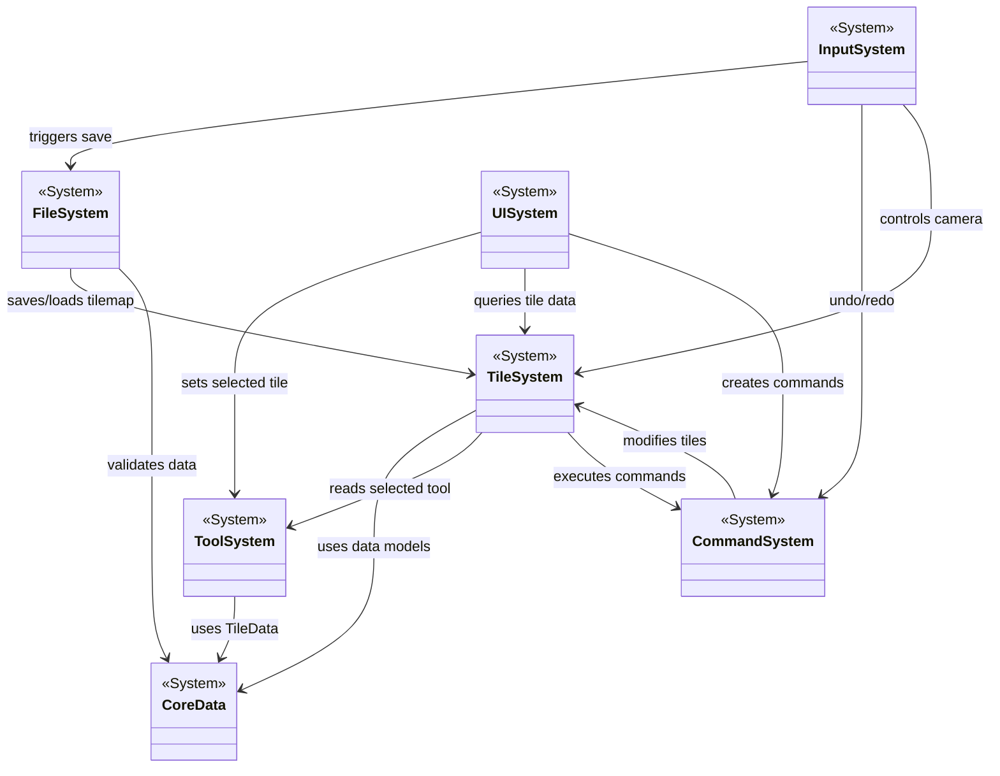
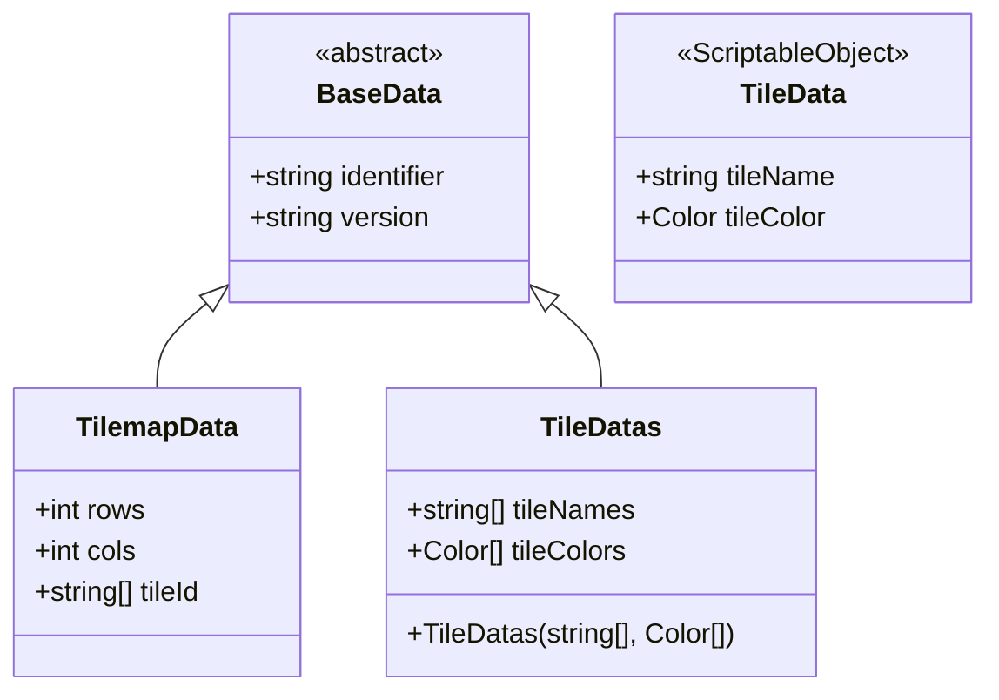
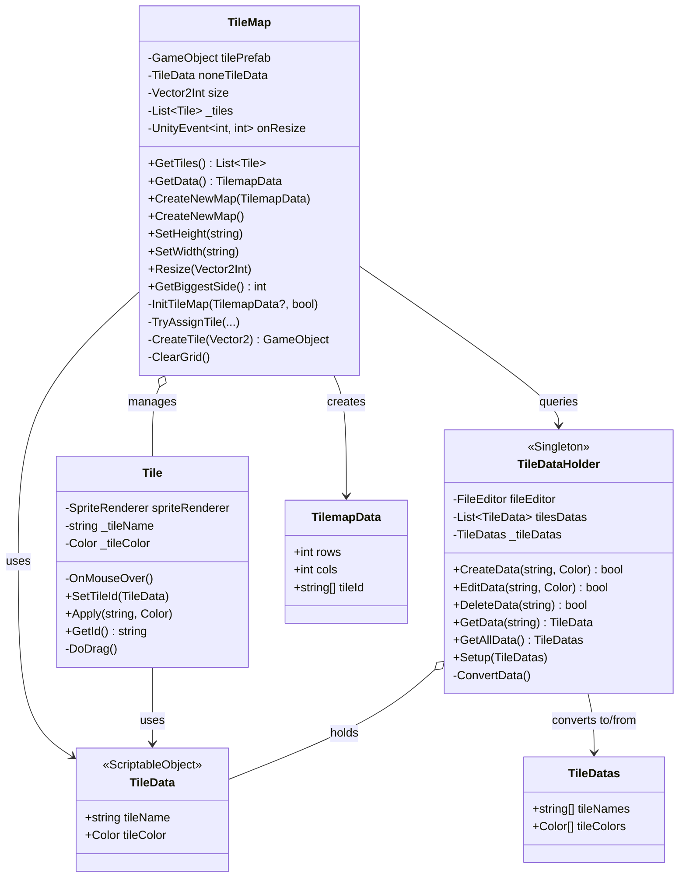
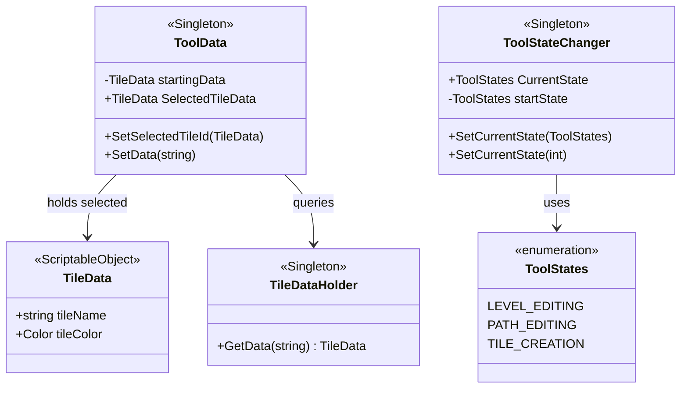
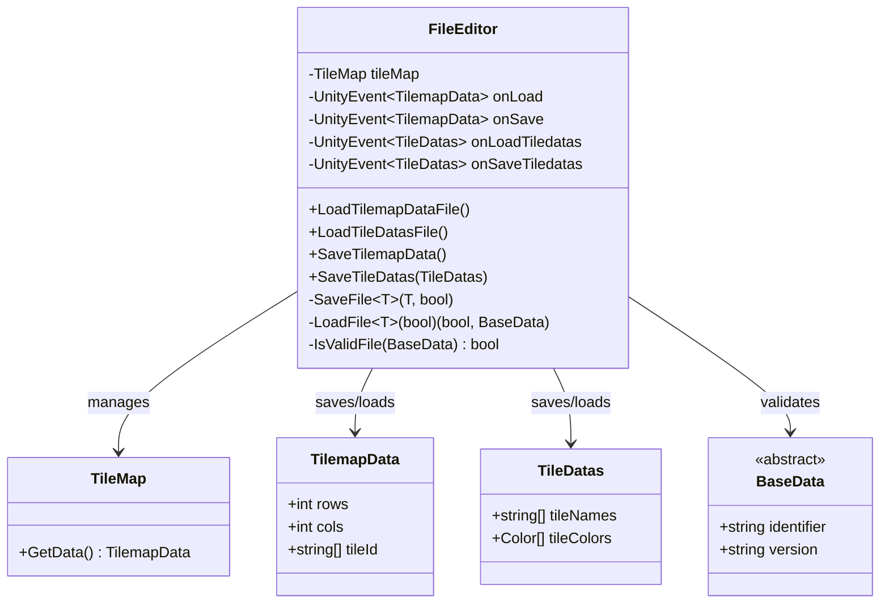
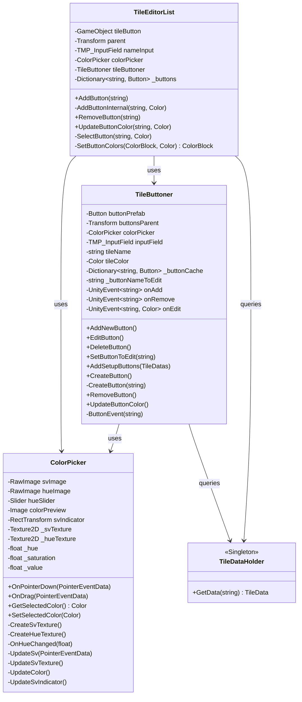
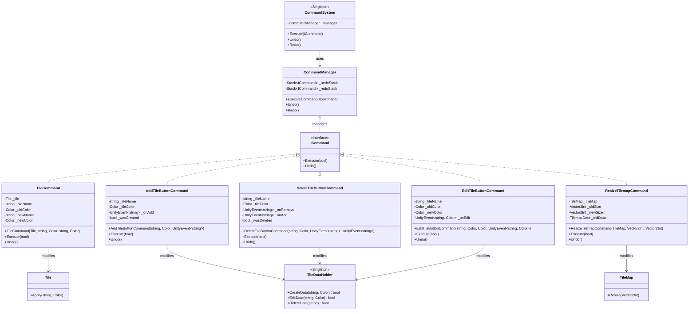
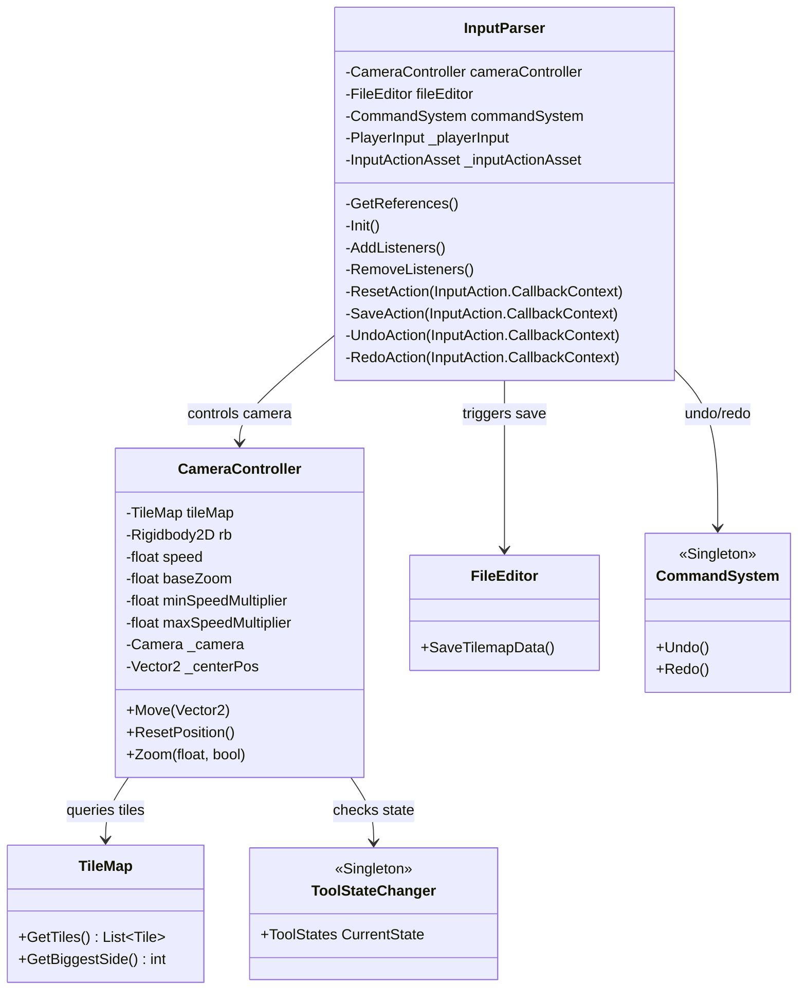
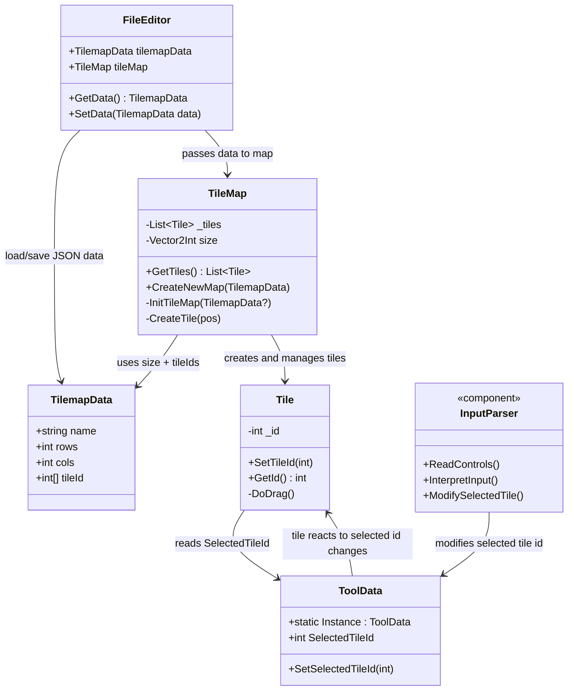

```mermaid
classDiagram
    %% ===============================
    %% Core Data Classes
    %% ===============================
    
    class BaseData {
        <<abstract>>
        +string identifier
        +string version
    }
    
    class TilemapData {
        +int rows
        +int cols
        +string[] tileId
    }
    
    class TileDatas {
        +string[] tileNames
        +Color[] tileColors
        +TileDatas(string[], Color[])
    }
    
    class TileData {
        <<ScriptableObject>>
        +string tileName
        +Color tileColor
    }
    
    %% ===============================
    %% Tool System
    %% ===============================
    
    class ToolData {
        <<Singleton>>
        -TileData startingData
        +TileData SelectedTileData
        +SetSelectedTileId(TileData)
        +SetData(string)
    }
    
    class ToolStateChanger {
        <<Singleton>>
        +ToolStates CurrentState
        -ToolStates startState
        +SetCurrentState(ToolStates)
        +SetCurrentState(int)
    }
    
    class ToolStates {
        <<enumeration>>
        LEVEL_EDITING
        PATH_EDITING
        TILE_CREATION
    }
    
    %% ===============================
    %% Tile System
    %% ===============================
    
    class TileMap {
        -GameObject tilePrefab
        -TileData noneTileData
        -Vector2Int size
        -List~Tile~ _tiles
        -UnityEvent~int, int~ onResize
        +GetTiles() List~Tile~
        +GetData() TilemapData
        +CreateNewMap(TilemapData)
        +CreateNewMap()
        +SetHeight(string)
        +SetWidth(string)
        +Resize(Vector2Int)
        +GetBiggestSide() int
        -InitTileMap(TilemapData?, bool)
        -TryAssignTile(...)
        -CreateTile(Vector2) GameObject
        -ClearGrid()
    }
    
    class Tile {
        -SpriteRenderer spriteRenderer
        -string _tileName
        -Color _tileColor
        -OnMouseOver()
        +SetTileId(TileData)
        +Apply(string, Color)
        +GetId() string
        -DoDrag()
    }
    
    class TileDataHolder {
        <<Singleton>>
        -FileEditor fileEditor
        -List~TileData~ tilesDatas
        -TileDatas _tileDatas
        +CreateData(string, Color) bool
        +EditData(string, Color) bool
        +DeleteData(string) bool
        +GetData(string) TileData
        +GetAllData() TileDatas
        +Setup(TileDatas)
        -ConvertData()
    }
    
    %% ===============================
    %% File System
    %% ===============================
    
    class FileEditor {
        -TileMap tileMap
        -UnityEvent~TilemapData~ onLoad
        -UnityEvent~TilemapData~ onSave
        -UnityEvent~TileDatas~ onLoadTiledatas
        -UnityEvent~TileDatas~ onSaveTiledatas
        +LoadTilemapDataFile()
        +LoadTileDatasFile()
        +SaveTilemapData()
        +SaveTileDatas(TileDatas)
        -SaveFile~T~(T, bool)
        -LoadFile~T~(bool) (bool, BaseData)
        -IsValidFile(BaseData) bool
    }
    
    %% ===============================
    %% UI System
    %% ===============================
    
    class ColorPicker {
        -RawImage svImage
        -RawImage hueImage
        -Slider hueSlider
        -Image colorPreview
        -RectTransform svIndicator
        -Texture2D _svTexture
        -Texture2D _hueTexture
        -float _hue
        -float _saturation
        -float _value
        +OnPointerDown(PointerEventData)
        +OnDrag(PointerEventData)
        +GetSelectedColor() Color
        +SetSelectedColor(Color)
        -CreateSvTexture()
        -CreateHueTexture()
        -OnHueChanged(float)
        -UpdateSv(PointerEventData)
        -UpdateSvTexture()
        -UpdateColor()
        -UpdateSvIndicator()
    }
    
    class TileButtoner {
        -Button buttonPrefab
        -Transform buttonsParent
        -ColorPicker colorPicker
        -TMP_InputField inputField
        -string tileName
        -Color tileColor
        -Dictionary~string, Button~ _buttonCache
        -string _buttonNameToEdit
        -UnityEvent~string~ onAdd
        -UnityEvent~string~ onRemove
        -UnityEvent~string, Color~ onEdit
        +AddNewButton()
        +EditButton()
        +DeleteButton()
        +SetButtonToEdit(string)
        +AddSetupButtons(TileDatas)
        +CreateButton()
        -CreateButton(string)
        +RemoveButton()
        +UpdateButtonColor()
        -ButtonEvent(string)
    }
    
    class TileEditorList {
        -GameObject tileButton
        -Transform parent
        -TMP_InputField nameInput
        -ColorPicker colorPicker
        -TileButtoner tileButtoner
        -Dictionary~string, Button~ _buttons
        +AddButton(string)
        -AddButtonInternal(string, Color)
        +RemoveButton(string)
        +UpdateButtonColor(string, Color)
        -SelectButton(string, Color)
        -SetButtonColors(ColorBlock, Color) ColorBlock
    }
    
    %% ===============================
    %% Input System
    %% ===============================
    
    class InputParser {
        -CameraController cameraController
        -FileEditor fileEditor
        -CommandSystem commandSystem
        -PlayerInput _playerInput
        -InputActionAsset _inputActionAsset
        -GetReferences()
        -Init()
        -AddListeners()
        -RemoveListeners()
        -ResetAction(InputAction.CallbackContext)
        -SaveAction(InputAction.CallbackContext)
        -UndoAction(InputAction.CallbackContext)
        -RedoAction(InputAction.CallbackContext)
    }
    
    class CameraController {
        -TileMap tileMap
        -Rigidbody2D rb
        -float speed
        -float baseZoom
        -float minSpeedMultiplier
        -float maxSpeedMultiplier
        -Camera _camera
        -Vector2 _centerPos
        +Move(Vector2)
        +ResetPosition()
        +Zoom(float, bool)
    }
    
    %% ===============================
    %% Command Pattern
    %% ===============================
    
    class ICommand {
        <<interface>>
        +Execute(bool)
        +Undo()
    }
    
    class CommandManager {
        -Stack~ICommand~ _undoStack
        -Stack~ICommand~ _redoStack
        +ExecuteCommand(ICommand)
        +Undo()
        +Redo()
    }
    
    class TileCommand {
        -Tile _tile
        -string _oldName
        -Color _oldColor
        -string _newName
        -Color _newColor
        +TileCommand(Tile, string, Color, string, Color)
        +Execute(bool)
        +Undo()
    }
    
    class AddTileButtonCommand {
        -string _tileName
        -Color _tileColor
        -UnityEvent~string~ _onAdd
        -bool _wasCreated
        +AddTileButtonCommand(string, Color, UnityEvent~string~)
        +Execute(bool)
        +Undo()
    }
    
    class ResizeTilemapCommand {
        -TileMap _tileMap
        -Vector2Int _oldSize
        -Vector2Int _newSize
        -TilemapData _oldData
        +ResizeTilemapCommand(TileMap, Vector2Int, Vector2Int)
        +Execute(bool)
        +Undo()
    }
    
    class DeleteTileButtonCommand {
        -string _tileName
        -Color _tileColor
        -UnityEvent~string~ _onRemove
        -UnityEvent~string~ _onAdd
        -bool _wasDeleted
        +DeleteTileButtonCommand(string, Color, UnityEvent~string~, UnityEvent~string~)
        +Execute(bool)
        +Undo()
    }
    
    class EditTileButtonCommand {
        -string _tileName
        -Color _oldColor
        -Color _newColor
        -UnityEvent~string, Color~ _onEdit
        +EditTileButtonCommand(string, Color, Color, UnityEvent~string, Color~)
        +Execute(bool)
        +Undo()
    }
    
    class CommandSystem {
        <<Singleton>>
        -CommandManager _manager
        +Execute(ICommand)
        +Undo()
        +Redo()
    }
    
    %% ===============================
    %% Relationships - Inheritance
    %% ===============================
    
    BaseData <|-- TilemapData
    BaseData <|-- TileDatas
    ICommand <|.. TileCommand
    ICommand <|.. AddTileButtonCommand
    ICommand <|.. ResizeTilemapCommand
    ICommand <|.. DeleteTileButtonCommand
    ICommand <|.. EditTileButtonCommand
    
    %% ===============================
    %% Relationships - Composition/Aggregation
    %% ===============================
    
    TileMap o-- Tile : manages
    TileMap --> TilemapData : creates
    TileMap --> TileData : uses
    TileMap --> TileDataHolder : queries
    
    Tile --> TileData : uses
    Tile --> ToolData : reads selected
    Tile --> ToolStateChanger : checks state
    Tile --> TileCommand : creates
    
    TileDataHolder o-- TileData : holds
    TileDataHolder --> TileDatas : converts to/from
    TileDataHolder --> FileEditor : saves through
    
    FileEditor --> TileMap : manages
    FileEditor --> TilemapData : saves/loads
    FileEditor --> TileDatas : saves/loads
    
    ToolData --> TileData : holds selected
    ToolData --> TileDataHolder : queries
    
    ToolStateChanger --> ToolStates : uses
    
    %% ===============================
    %% Relationships - UI
    %% ===============================
    
    TileButtoner --> ColorPicker : uses
    TileButtoner --> TileDataHolder : queries
    TileButtoner --> AddTileButtonCommand : creates
    TileButtoner --> DeleteTileButtonCommand : creates
    TileButtoner --> EditTileButtonCommand : creates
    
    TileEditorList --> ColorPicker : uses
    TileEditorList --> TileButtoner : uses
    TileEditorList --> TileDataHolder : queries
    
    InputParser --> FileEditor : triggers save
    InputParser --> CommandManager : undo/redo
    InputParser --> CameraController : controls camera
    
    CameraController --> TileMap : queries tiles
    CameraController --> ToolStateChanger : checks state
    
    %% ===============================
    %% Relationships - Commands
    %% ===============================
    
    CommandManager o-- ICommand : manages
    CommandSystem --> CommandManager : uses
    TileCommand --> Tile : modifies
    AddTileButtonCommand --> TileDataHolder : modifies
    DeleteTileButtonCommand --> TileDataHolder : modifies
    EditTileButtonCommand --> TileDataHolder : modifies
    ResizeTilemapCommand --> TileMap : modifies
```

# TowerDefenceLevelEditor
The tool is a grid-based level editor for tower defense games that allows level designers to create layouts without a test or play mode. Using a dynamic canvas, various tile types can be placed, enemy routes can be defined with multiple paths and intersections, and custom content can optionally be added. The tool includes basic functionality such as tile selection, canvas resizing, and path editing, and offers save/load capabilities that save levels in JSON format.

The final output is a game-ready data file with canvas size, tile map, path nodes, and any asset mappings. The test build focuses on drawing the grid, changing tiles, JSON save/load, and basic canvas resizing. The full version expands on this with more extensive editing tools, pre-export validation, and UI improvements.

# Tower Defense Level Editor - Beta UML class diagram

  
Complete System Overview

  
Everthing

  
Core Data System

  
Tile System

  
Tool System

  
File System

  
UI

  
Command Pattern System

  
Input & Camera System

## Beta todo list
Feedback from teachers:
- ~~Custom tile do not work when loading it in when you don't have the custom tile.~~
- Constrains per tile (end and start)
- ~~Tile editing~~
- Enemy path drawing/editing
- UI/UX
- Ctrl+Z, Ctrl+Y via command pattern
  - ~~Tile placement~~
  - ~~Tile adding/editing~~
  - ~~Size~~
  - enemy paths

# Alpha UML class diagram

